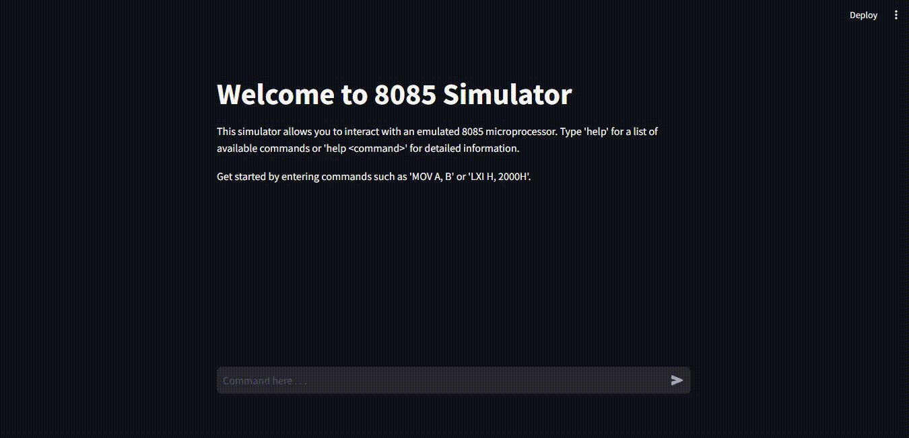

# 8085 Microprocessor Simulator App.

Welcome to the 8085 Microprocessor Simulator Web App.

## Overview

This project provides a user-friendly app interface for simulating the 8085 microprocessor. **The simulator allows you to interact with an emulated 8085 microprocessor through a Streamlit-based application with a chat-like frontend**. Execute instructions, observe the microprocessor's state, and explore various components such as registers, memory, flags, ports, and more using natural language commands.

## Features

- Execute a variety of 8085 instructions using an intuitive chat-like interface.
- Streamlined commands for exploring the state of the microprocessor.
- AI feature for contextual understanding of 8085 microprocessor-related questions.
- Ability to execute instructions bitwise or in compile mode.

## Getting Started

### Prerequisites

Before running the simulator app, ensure that you have the required Python modules installed. You can install them using the following command:

```bash
pip install streamlit prettytable
pip install -q -U google-generativeai
```

### Running the Simulator App
1. Clone the repository:
```bash
https://github.com/girisakar365/8085-mP.git
```
2. Navigate to the project directory:
```bash
cd 8085-mP
```
3. Run the Streamlit app:
```bash
streamlit run App.py
```

### Usage
After launching the simulator app, you will be greeted with an introduction and a chat-like interactive interface.

Enter 8085 microprocessor instructions in the provided chat input box to execute various operations. For example:

Explore the state of the microprocessor using interactive commands available in the chat-like interface.

### Note
1. As of now, not all instructions are available, and updates are constantly being made. __Instructions up to logical operations are supported__.
1. Ensure that you provide valid arguments and follow the correct syntax for each instruction.
1. __As of now, not all instructions are available (available upto logical operators), and updates are constantly being made. Instructions up to arithmetic operations are supported__.
2. __None of the flags are effected if any such operations are performed.__
2. Ensure that you provide valid arguments and follow the correct syntax for each instruction. For additional information on specific commands, use the help command followed by the command name. For example:
```bash
> help MOV
```

### Supported Platforms
The simulator app is compatible with Windows, Linux, and macOS.

- Windows: No additional considerations.
- Linux: Ensure you have the necessary dependencies by running the command mentioned under ["Prerequisites"](#prerequisites).
- macOS: Similar to Linux, ensure the required dependencies are installed.

### App Teaser


### Contributing
- Linux: Ensure you have the necessary dependencies by running the command mentioned under [Prerequisites.](#prerequisites)
- macOS: Similar to Linux, ensure the required dependencies are installed.

## Currently Working On:
1. Flag modification `main`
1. Branching Group `main`
2. AI integration
2. Stack Group

## Contributing
Feel free to contribute to the project by opening issues or submitting pull requests. Your feedback and contributions are highly appreciated. Happy coding!